## Introduction
### What is bode plot:
A Bode plot is a plot of the magnitude and phase of a transfer function or other complex-valued quantity, vs. frequency. Magnitude in decibels, and phase in degrees, are plotted vs. frequency, using semilogarithmic axes. The magnitude plot is effectively a log-log plot, since the magnitude is expressed in decibels and the frequency axis is logarithmic.

The magnitude in decibels (dB) is calculated using the following formula:

$$
\|G\|_{\mathrm{dB}} = 20\log_{10}\left(\|G\|\right)
$$

If $G=(\frac{f}{f_0})^n$, the magnitude in decibels (dB) is given by:

$$
\
|G|_{\mathrm{dB}}
=20\log_{10}\left|\left(\frac{f}{f_0}\right)^n\right|
=20n\log_{10}\left(\frac{f}{f_0}\right)
\
$$

  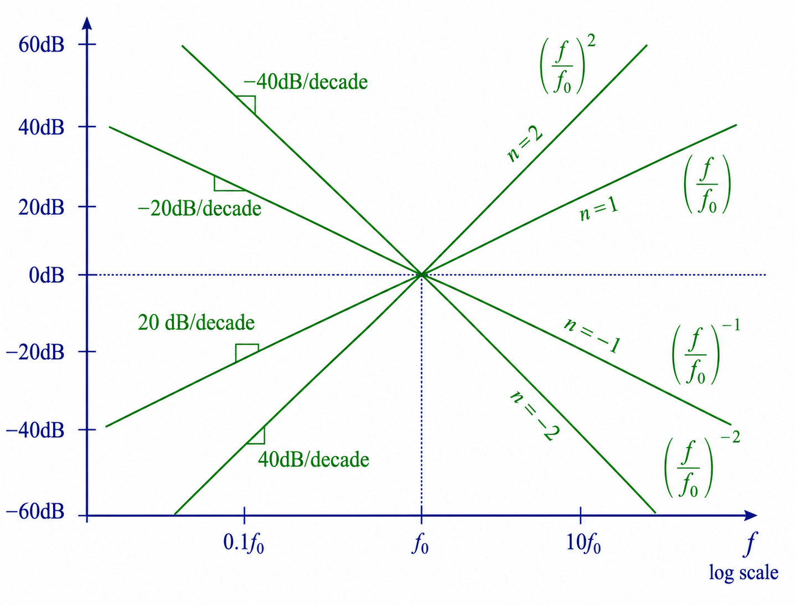

##
### Single Pole Response
Consider the RC circuit below. As illustrated, the circuit consists of a series RC branch connected to a voltage source. The transfer function is determined by the voltage divider formula shown below:

  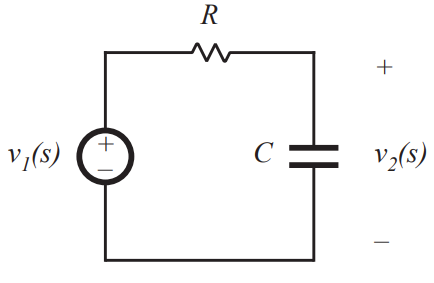

$$
H(s) = \frac{V_2(s)}{V_1(s)} = \frac{\frac{1}{sC}}{R + \frac{1}{sC}} = \frac{1}{sRC + 1}
$$

Then we have:

$$
H(s) = \frac{1}{1 + \frac{s}{\omega_0}} \quad \text{where} \quad \omega_0 = \frac{1}{RC}
$$

Since $R$ and $C$ are real positive quantities, $\omega_0$ is also real and positive. The denominator of ebove Eq contains a root at $s = -\omega_0$, and hence $G(s)$ contains a real pole in the left half of the complex plane [1].  

To find the magnitude and phase of the transfer function, we let $s = j\omega$, where $j$ is the square root of $-1$. We then find the magnitude and phase of the resulting complex-valued function. With $s = j\omega$, equation becomes[1]: 

$$
G(j\omega) = \frac{1}{\left(1 + j \frac{\omega}{\omega_0}\right)} = \frac{1 - j \frac{\omega}{\omega_0}}{1 + \left(\frac{\omega}{\omega_0}\right)^2}
$$

$$
\|G(j\omega)\| = \sqrt{\left[\text{Re}\left(G(j\omega)\right)\right]^2 + \left[\text{Im}\left(G(j\omega)\right)\right]^2} = \frac{1}{\sqrt{1 + \left(\frac{\omega}{\omega_0}\right)^2}}
$$

$$
\|G(j\omega)\|_{\text{dB}} = -20 \log_{10} \left(\sqrt{1 + \left(\frac{\omega}{\omega_0}\right)^2}\right) \text{ dB}
$$

The best practice for drawing the magnitude Bode plot of $G$ is to determine the asymptotic behavior for large and small frequencies.

$$
\omega \ll \omega_0 \text{ and } f \ll f_0 \rightarrow \left(\frac{\omega}{\omega_0}\right) \ll 1 \rightarrow \|G(j\omega)\| \approx 1 \text{ or } 0\text{dB}
$$

$$
\omega \gg \omega_0 \text{ and } f \gg f_0 \rightarrow \left(\frac{\omega}{\omega_0}\right) \gg 1 \rightarrow \|G(j\omega)\| \approx \frac{1}{\sqrt{\left(\frac{\omega}{\omega_0}\right)^2}} = \left(\frac{f}{f_0}\right)^{-1}
$$

Then the magnitude asymptotes is:

  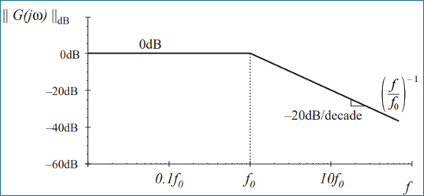

For evaluating exact magnitude we can use magnitude calculation in some point which are simple.

$$
\text{at } f = f_0 : \begin{cases} 
|G(j\omega_0)| = \frac{1}{\sqrt{1 + \left(\frac{\omega_0}{\omega_0}\right)^2}} = \frac{1}{\sqrt{2}} \\
\|G(j\omega_0)\|_{\text{dB}} = -20 \log_{10} \left(\sqrt{1 + \left(\frac{\omega_0}{\omega_0}\right)^2}\right) \approx -3 \text{ dB} 
\end{cases}
$$

at $f = 0.5f_0$ and $f = 2f_0$ : Similar arguments show that the exact curve lies 1dB below the asymptotes.

  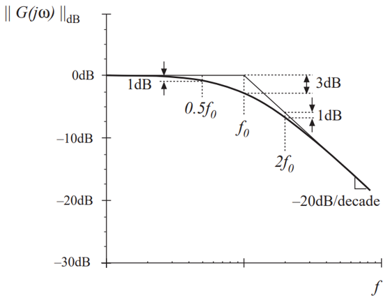

The phase of $G(j\omega_0)$ is:

$$
\angle G(j\omega) = \tan^{-1} \left( \frac{\text{Im} \{ G(j\omega) \}}{\text{Re} \{ G(j\omega) \}} \right)
$$

if: 

$$
G(j\omega) = \frac{1}{\left(1 + j \frac{\omega}{\omega_0}\right)} = \frac{1 - j \frac{\omega}{\omega_0}}{1 + \left(\frac{\omega}{\omega_0}\right)^2}
$$

Then: 

$$
\angle G(j\omega) = -\tan^{-1} \left( \frac{\omega}{\omega_0} \right)
$$

We can estimate the phase of $G(j\omega)$ for very small and large frequencies, as well as at $\omega_0$. The result is illustrated in below:

  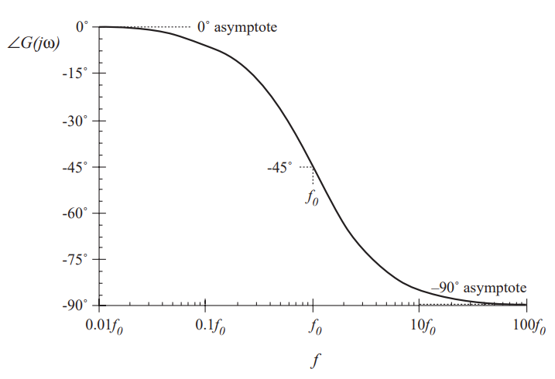

According to $\angle G(j\omega)$ equation, at corner frequency $(f=f_0)$, the phase is $-45^\circ$. For drawing a more accurated graph we need a third asymptote to approximate the phase. A simpler choice could be:

$$
f_a = \frac{f_0}{10}
$$
$$
f_b = 10f_0
$$

At the break frequencies,the actual phase deviates from the asymptotes by $\tan^{-1}(0.1) \approx 5.7^\circ$

Based on the explanation above, the Bode plot for a real pole (a left-half-plane or negative pole) is illustrated in the picture below:

  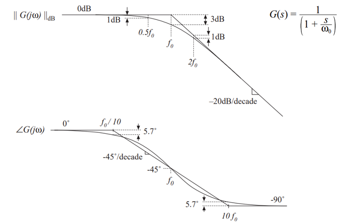

Using the same approach, the magnitude and phase Bode plots for a real zero are shown below:

### Real Zero (Left half-plane zero)

  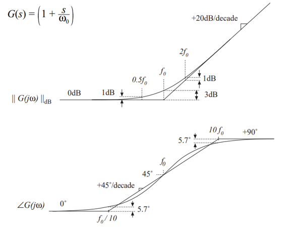

### Right half-plane zero

  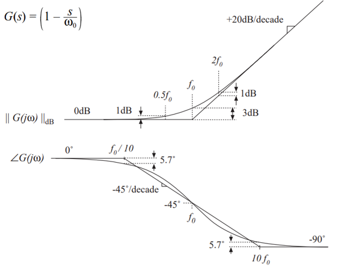

### Inverted pole

  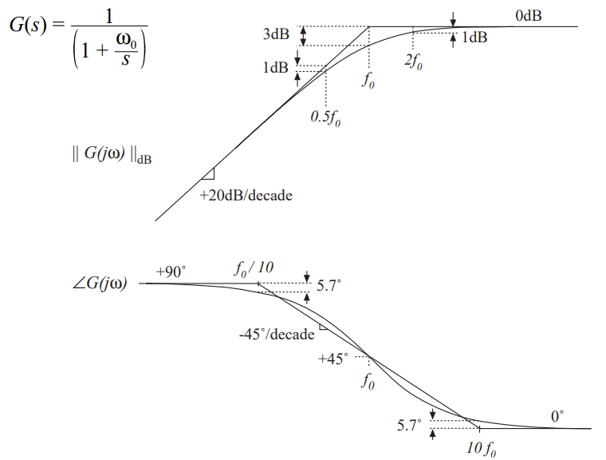

### Inverted zero

  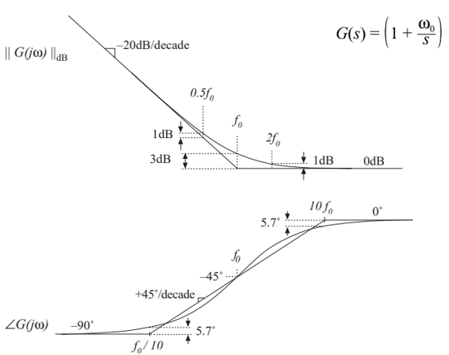

## Review of combination
The Bode diagram of a transfer function containing several pole, zero, and gain terms, can be constructed by simple addition. At any given frequency, the magnitude (in decibels) of the composite transfer function is equal to the sum of the decibel magnitudes of the individual terms. Likewise, at a given frequency the phase of the composite transfer function is equal to the sum of the phases of the individual terms.

Suppose that we have constructed the Bode diagrams of two complex-values functions of frequency:

$$
G_3(\omega)=G_1(\omega)\,G_2(\omega)
$$

#### And: 

$$
G_1(\omega)=R_1(\omega)e^{j\theta_1(\omega)}
$$

$$
G_2(\omega)=R_2(\omega)e^{j\theta_2(\omega)}
$$

$$
G_3(\omega)=R_3(\omega)e^{j\theta_3(\omega)}
$$

#### If:

$$
G_3(\omega)=G_1(\omega)\,G_2(\omega)
$$

#### Then:

$$
G_3(\omega)=R_1(\omega)e^{j\theta_1(\omega)}
R_2(\omega)e^{j\theta_2(\omega)}
$$

$$
G_3(\omega)=
\left(R_1(\omega)R_2(\omega)\right)
e^{j\left(\theta_1(\omega)+\theta_2(\omega)\right)}
$$

$$
\left|R_3(\omega)\right|_{\mathrm{dB}}=\left|R_1(\omega)\right|_{\mathrm{dB}}+\left|R_2(\omega)\right|_{\mathrm{dB}}
$$

# Example: Constructing a Bode Plot

Consider the following transfer function:

$$
G(s)=\frac{G_0}
{\left(1+\dfrac{s}{\omega_1}\right)
\left(1+\dfrac{s}{\omega_2}\right)}
$$

where

$$
G_0=40 \qquad (32~\mathrm{dB})
$$

$$
f_1=\frac{\omega_1}{2\pi}=100~\mathrm{Hz}
$$

$$
f_2=\frac{\omega_2}{2\pi}=2~\mathrm{kHz}
$$

This transfer function consists of one constant gain and two first-order poles. The Bode plot can be constructed by analyzing the contribution of each term separately and then adding their effects together.

---

## Step 1. Constant Gain

The constant gain affects only the magnitude response.

Its magnitude in decibels is

$$
20\log_{10}(40)=32~\mathrm{dB}.
$$

Therefore,

- Magnitude = **32 dB**
- Phase = **0°**

The gain contributes a horizontal line in the magnitude plot and does not change the phase.

---

## Step 2. First Pole

The first pole is located at

$$
f_1=100~\mathrm{Hz}.
$$

Its contribution is

### Magnitude

- 0 dB below 100 Hz
- −20 dB/decade above 100 Hz

### Phase

- Approximately 0° below 10 Hz
- Decreases gradually between 10 Hz and 1 kHz
- Approaches −90° above 1 kHz

---

## Step 3. Second Pole

The second pole is located at

$$
f_2=2~\mathrm{kHz}.
$$

Its contribution is

### Magnitude

- 0 dB below 2 kHz
- −20 dB/decade above 2 kHz

### Phase

- Approximately 0° below 200 Hz
- Decreases gradually between 200 Hz and 20 kHz
- Approaches −90° above 20 kHz

---

## Step 4. Construct the Magnitude Plot

The overall magnitude is obtained by adding the magnitude (in dB) of all individual terms.

| Frequency Range | Composite Slope |
| :-------------- | --------------: |
| $f<100$ Hz | 0 dB/decade |
| $100~\mathrm{Hz}<f<2~\mathrm{kHz}$ | −20 dB/decade |
| $f>2~\mathrm{kHz}$ | −40 dB/decade |

Therefore,

- Below **100 Hz**, the magnitude remains at **32 dB**.
- At **100 Hz**, the first pole changes the slope to **−20 dB/decade**.
- At **2 kHz**, the second pole changes the slope to **−40 dB/decade**.

---

## Step 5. Construct the Phase Plot

The total phase is obtained by adding the phase contribution of each pole.

| Frequency Range | Total Phase |
| :-------------- | ----------: |
| $f<10$ Hz | $0^\circ$ |
| $10~\mathrm{Hz}<f<200~\mathrm{Hz}$ | First pole begins decreasing |
| $200~\mathrm{Hz}<f<1~\mathrm{kHz}$ | Both poles contribute |
| $1~\mathrm{kHz}<f<20~\mathrm{kHz}$ | First pole ≈ $-90^\circ$, second pole decreasing |
| $f>20~\mathrm{kHz}$ | $-180^\circ$ |

At high frequencies,

$$
\phi_{\mathrm{total}}=-90^\circ+(-90^\circ)=-180^\circ.
$$

---

## Summary

The Bode plot of a transfer function is constructed by decomposing the transfer function into simple gain, pole, and zero terms.

- The **magnitude plot** is obtained by adding the magnitude of each term in **decibels (dB)**.
- The **phase plot** is obtained by adding the phase contribution of each term.
- Each first-order pole contributes a slope of **−20 dB/decade** to the magnitude plot after its corner frequency and introduces a total phase lag of **−90°**.

This graphical approach greatly simplifies the frequency-domain analysis of complex transfer functions and forms the foundation of controller design in power electronics.

  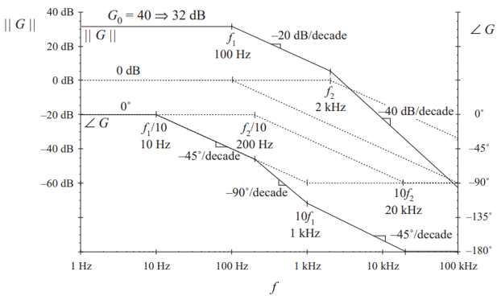

## Summary of Basic Bode Plot Building Blocks

| Term | Transfer Function | Magnitude Effect | Phase Effect |
| :--- | :--- | :---: | :---: |
| Constant Gain | $K$ | $20\log_{10}(K)$ dB | $0^\circ$ (or $180^\circ$ if $K<0$) |
| Real Pole | $\displaystyle \frac{1}{1+\frac{s}{\omega_p}}$ | −20 dB/decade after $\omega_p$ | $-90^\circ$ |
| Real Zero | $\displaystyle 1+\frac{s}{\omega_z}$ | +20 dB/decade after $\omega_z$ | $+90^\circ$ |
| Right Half-Plane (RHP) Zero | $\displaystyle 1-\frac{s}{\omega_z}$ | +20 dB/decade after $\omega_z$ | $-90^\circ$ |
| Inverted Pole | $\displaystyle \frac{1}{1-\frac{s}{\omega_p}}$ | −20 dB/decade after $\omega_p$ | $+90^\circ$ |
| Inverted Zero | $\displaystyle 1-\frac{s}{\omega_z}$ | +20 dB/decade after $\omega_z$ | $-90^\circ$ |

> **Note**
>
> - A **real pole** decreases the magnitude slope by **20 dB/decade** and introduces a total phase lag of **90°**.
> - A **real zero** increases the magnitude slope by **20 dB/decade** and introduces a total phase lead of **90°**.
> - A **right half-plane (RHP) zero** has the same magnitude response as a real zero, but its phase decreases by **90°**, making it a **non-minimum-phase** element.
> - Inverted poles and inverted zeros are less common in practical controller design but are useful for understanding unstable systems and sign inversions.

---

## References

[1] [Fundamentals of Power Electronics](https://fmipa.umri.ac.id/wp-content/uploads/2016/03/R._Erickson_Fundamentals_of_Power_Electronics_pBookZZ.org_.pdf)
