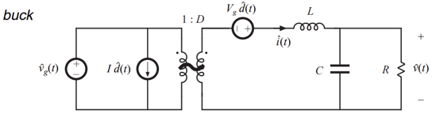

Small-signal ac equations of the buck-boost converter, derived as below:

  

$$
L \frac{d\hat{i}(t)}{dt} = D\hat{v}_g(t) + D'\hat{v}(t) + (V_g - V)\hat{d}(t)
$$

$$
C \frac{d\hat{v}(t)}{dt} = -D'\hat{i}(t) - \frac{\hat{v}(t)}{R} + I\hat{d}(t)
$$

$$
\hat{i}_g(t) = D\hat{i}(t) + I\hat{d}(t)
$$

The converter contains two inputs, $V\hat{i}(s)$ and $V\hat{i}(d)$ 
