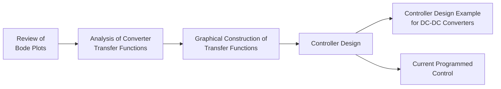

# Controller Design Handbook

Welcome!

This repository contains my research notes, controller design methods, simulations, and reports on power electronics.

---

## Topics

# 📚 Controller Design Handbook

Welcome to my handbook on controller design for power electronics.

## Learning Path

1. 📈 [Review of Bode Plots](01-Review-of-Bode-Plots/)
2. 📊 [Analysis of Converter Transfer Functions](02-Transfer-Functions/)
3. 📐 [Graphical Construction of Transfer Functions](03-Graphical-Construction/)
4. 🎯 [Controller Design](04-Controller-Design/)
5. 💡 [Application Example in Lighting Project](05-Lighting-Project/)
6. ⚡ [Current Programmed Control](06-Current-Programmed-Control/)

---

More chapters will be added.
